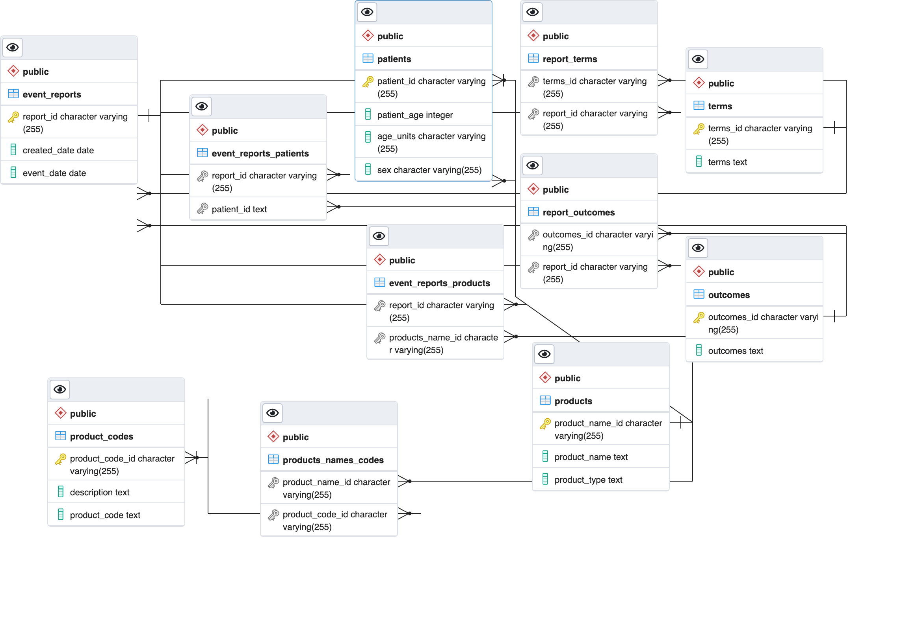

## Part 1: Create an ER Diagram by inspecting tables

```
continents has a one-to-many relationship with regions because of foreign key regions_ibfk_1 in regions that references continent_id in continents

regions has a one-to-many relationship with countries because of foreign key countries_ibfk_1 in countries that references region_id in regions

countries has a one-to-many relationship with country_languages because of foreign key country_languages_ibfk_1 in country_languages that references primary key country_id in countries

languages has a one-to-many relationship with country_languages because of foreign key country_languages_ibfk_2 in country_languages that references language_id in languages

countries has a many-to-many relationship with languages because of foreign key country_languages_ibfk_1 in country_languages that references primary key country_id in countries and foreign key country_languages_ibfk_2 in country_languages that references language_id in languages --> countries can map to multiple languages and languages can map to multiple countries

countries has a one-to-many relationship with country_stats because of foreign key country_stats_ibfk_1 in country_stats that references primary key country_id in countries

```
## Part 3: Examine a data set and create a normalized data model to store the data

```
### 1. This query shows all non-unique report_ids and their counts

report_id    | count
-----------------+-------
180072          |     3
181790          |     4
204980          |     3
184966          |     2
180281          |    10
174642          |     2
192864          |     2
189026          |     2
180555          |     2
175124          |     6
(truncated)
```

```
### 2. This queries finds all the products that map to more than one product_code

product                         | not_distinct
---------------------------------------------------------+--------------
QUORN CHIK'N NUGGETS                                    |            2
LIMBREL (FLAVOCOXID)                                    |            2
MARKETSIDE PREMIUM ROMAINE SALAD                        |            2
SIMILAC SPECIAL CARE 20                                 |            2
GREAT VALUE CAJUN TRAIL MIX                             |            2
QUORN CHICKEN PATTY                                     |            2
RED DYE                                                 |            2
HOSTESS SUZY Q                                          |            2
MODERE SYNC                                             |            2
NEOCATE INFANT                                          |            2
(truncated)
```

```
### 3. Finding a relatinoship between product_codes and description, after trimming all the description strings (so there) is no
### more leading and trailing space, you can see that each product_code maps to only one description --> not_distinct represents
### how many product_codes map to more than one description and if none are returned, each product_code maps to only one

product_code | not_distinct
--------------+--------------
```

```
### 4. This query works on finding a candidate key for the original data set by seeing if any rows in the data field have all of
### the same products, product_codes, and report_ids and if so which entries do --> the not_distinct id field tells us from
### the products that map to multiple product_codes which also map to multiple report_ids and if so, how many ids they map to

report_id    |                    product                     | not_distinct_id
-----------------+------------------------------------------------+-----------------
173066          | EXEMPTION 4                                    |               2
173435          | EXEMPTION 4                                    |               2
173728          | EXEMPTION 4                                    |               2
174106          | EXEMPTION 4                                    |               2
174214          | EXEMPTION 4                                    |               2
174791          | EXEMPTION 4                                    |               2
174936          | EXEMPTION 4                                    |               2
175843          | EXEMPTION 4                                    |               2
176028          | EXEMPTION 4                                    |               2
176097          | EXEMPTION 4                                    |               2
(truncated)
```

```
### 5. This query finds a candidate key for the original data set --> the original data set has 50440 rows and when concatenating
### a primary key in the way I do using certain columns, it results in the same number of distinct values making it a possible
### primary key

count
-------
50440

distinct_keys
---------------
        50440
```


```
- The event_reports table has a many-to-many relationship with patients because event_reports can map to a multitude of patients and patients be a part of of different event_reports
- The event_reports table has a many-to-many relationship with products because event_reports can map to a multitude of products and products can map to a multitude of event_reports
- The event_reports table has a many-to-many relationship with terms because event_reports can map to a multitude of terms and terms can map to a multitude of event_reports
- The event_reports table has a many-to-many relationship with outcomes because event_reports can map to a multitude of outcomes and outcomes can map to a multitude of event_reports
- The products table has a many-to-many relationship with product_codes because a product can map to multiple product_codes and a product_code can map to multiple products

```
